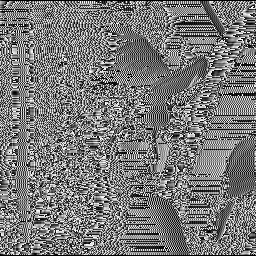
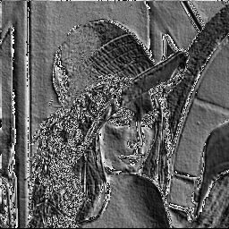
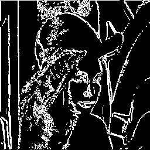
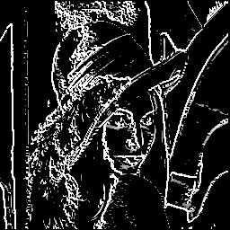

# MIPS-Traitement_Image

## Description
Le projet consiste à utiliser le filtre de Sobel pour pouvoir récupérer les 
contours d'une image .bmp via l'assembleur MIPS à l'aide de MARS4.5.
Le programme nécéssite une amélioration et une optimisation ultérieurement ! 

## Evolution 
#### Figure 1 : Image à filtrée 

#### Figure 2 : Première version

#### Figure 3 : Deuxième version

#### Figure 4 : Troisième version

#### Figure 5 : Dernière version

## Auteurs
Hayk ZARIKIAN et Ambre LIS
